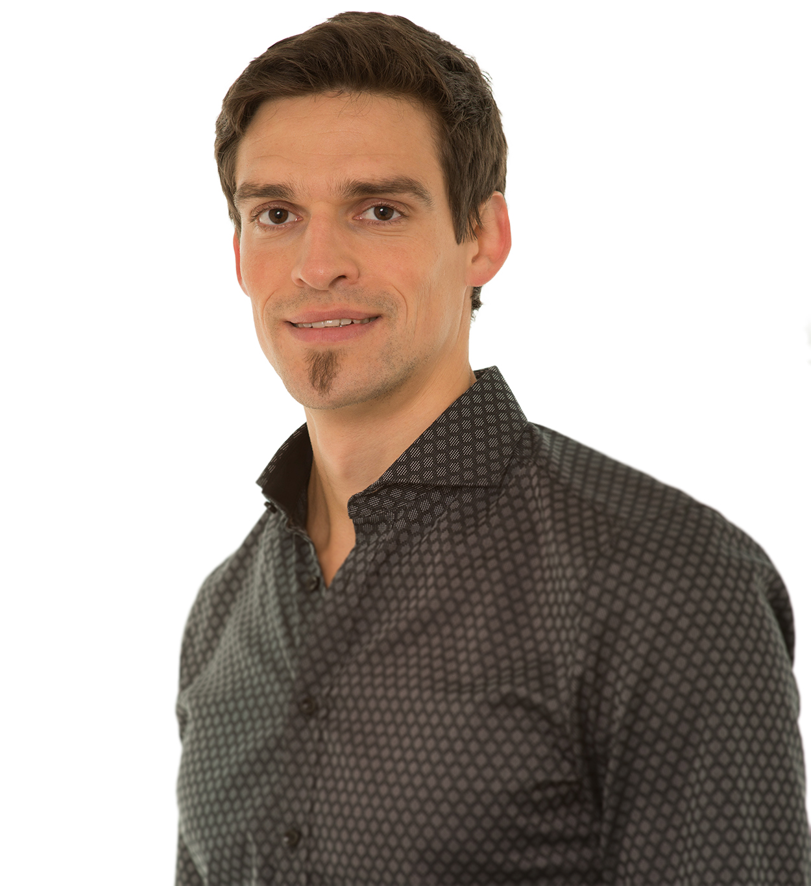

---

## **Current Profession**

I'm currently working as a PhD student in the [Pinhassi lab](https://lnu.se/en/staff/jarone.pinhassi/) at Linnaeus University in Kalmar (Sweden), in the field of aquatic microbial ecology.

---

## **Research Focus**

The main focus of my current research is to investigate the role of marine bacterioplankton in carbon cycling by deciphering the genetic basis for organic carbon utilization. Dissolved organic carbon (DOC) derived from phytoplankton photosynthesis represents the main biologically available organic carbon pool in the ocean. The uptake and utilization of organic carbon compounds is largely determined by the metabolic potential encoded in the genomes of marine bacteria, although molecular detail on how they impact on particular element cycles remain largely unknown.

My research is based on state-of-the-art techniques in microbiology, microbial ecology, and molecular biology such as metagenomics and metatranscriptomics and mainly based on field studies, microcosm and mesocosm experiments.

I'm personally interested in the dynamics of **natural microbial assemblages**. My curiosity  goes beyond phylogenetic composition and is dealing with the **functional role** of Microbes (What do they do? & Who is doing it?).

---

## **Objectives & Aims**

- What is the functional response of Bacteria to various **labile dissolved organic matter (LDOM)** model compounds? (see <a href="project1.html">**DOM project**</a>),
- What do Bacteria express in different stages of a phytoplankton bloom? (see <a href="project2.html">**ENVISION project**</a>)
- What is the functional role of Bacteria in different **strongly stratified water masses**? (see <a href="project3.html">**KB project**</a>)
- What are the **interactions** between **Bacteria and Eukaryotes**? (see <a href="project4.html">**LMO project**</a> and <a href="project5.html">**Collaborations**</a>)
- What are the **interactions** between **Microbes** and **Zooplankton derived DOM**? (see <a href="project6.html">**Collaborations**</a>)

---

## **Intensions & Aims of Outreach**

This webpage should provide knowledge about the importance of microorganisms based on my own research activities in the frame of my PhD-thesis. I'm aiming on presenting scientific content about ongoing research in an "not-too-scientific" understandable form with YOU! A special focus should be on discussing the relevance of single projects but more importantly, I'd like to put several projects together and to discuss them at a relatively broad level. I'm aiming on communicating science within academia but more importantly with society. For those of you who are more interested in details, please check the <a href="publications.html">**Publications**</a> section.

>I hope you'll enjoy exploring my webpage and stay tuned!

---

---
