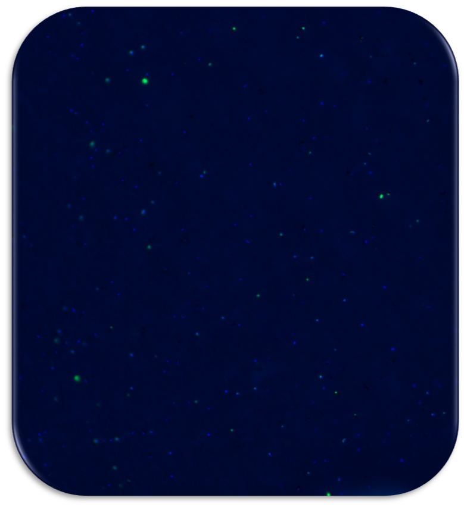

---

This is an epifluorescence microscopy image showing the fluorescence of microbial DNA after staining few mililiters of seawater with specific dyes. Visible in blue colour are all organisms (Bacteria and Archaea), while the green colour indicates Bacteria only after hybridization with the EUB FISH probe (Fluorescence In Situ Hybridization).

---

## **Did you know that:**

- **1 mL** of seawater contains around **1 billion** microbial cells!

- Microorganisms are the **key players in biogeochemical cycles** for example the carbon cycle with major implications for regulating the Earth's climate!

- The total estimated **microbial surface area** is the **largest on this planet**!

---

