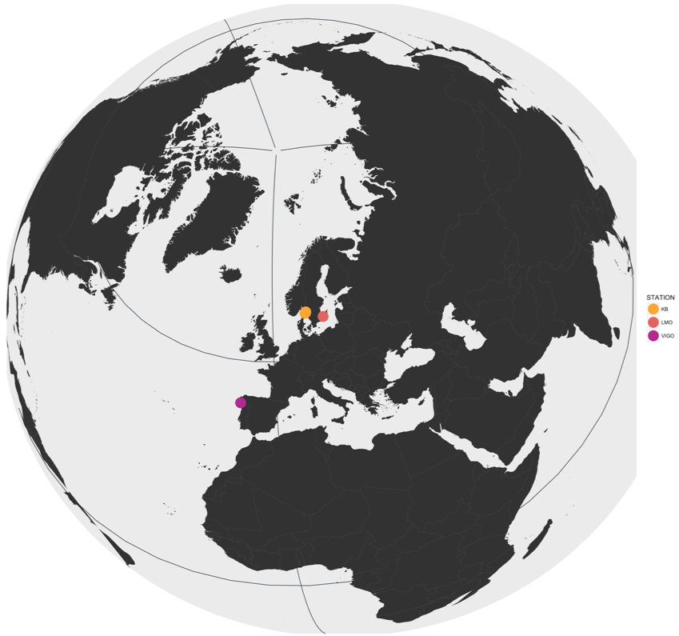

---

---

## **Dissolved Organic Matter (DOM) Additions**

> Dissolved organic matter (DOM) represents the main labile carbon source in the ocean. Bacteria are key drivers in biogeochemical cycling of carbon, since they assimilate and respire organic matter. However, molecular detail on the interaction between bacteria and DOM is lacking. We thus conducted Baltic Sea seawater culture experiments enriched with either polymers or their corresponding monomers to study the functional gene expression response of heterotrophic and mixotrophic bacteria. These findings will provide novel knowledge of key molecular mechanisms used by marine bacteria to assimilate and metabolize marine DOM. We infer that such knowledge is critical for understanding how functional genes and bacterial community composition impact biogeochemical cycling of DOM.

---

## **ENVISION - The role of Vitamins**

> Phytoplankton derived dissolved organic matter (DOM) can be readily assimilated by bacterioplankton. The availability of inorganic nutrients and more recently of vitamins has been recognized as limiting factors for auxotrophic phytoplankton growth. However, fundamental understanding on the underlying mechanisms involved in those interactions and the degradation of labile DOM is still rudimentary. Therefore, we conducted mesocsosm experiments with nutrient rich sewater from an upwelling system in the North-East Atlantic Ocean as part of the ENVISION project. In order to study the functional gene expression response of natural microbial assemblages during pre- and postbloom conditions. We infer that such knowledge is crucial for understanding the dynamics, both at the functional gene expression and the community level, of organic matter cycling during pronounced phytoplankton growth.

---

## **Microbial Activity in a stratified water column**

Add a short project description such as parts of my abstracts
-Where?
-What is it about?
-Why?
-How?

---
